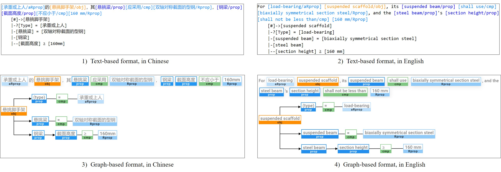

# Auto Rule Transform
Auto Rule Transform: Automated rule transformation for automated rule checking.  
This repo contains the codes & data for the paper entitiled "Deep NLP-based automated rule transformation for automated regulatory compliance checking"  

## Background & Introduction
As an alternative to manual regulatory compliance checking of design, which is time-consuming and error-prone, automated rule checking (ARC) is expected to significantly promote the design process in the architecture, engineering, and construction (AEC) industry. The most vital and complex stage of ARC is interpreting regulation texts into a computer-processable format. However, existing systems and studies of rule interpretation cannot achieve both a high level of automation and scalability because they either require considerable manual effort or are based on a hard-coded manner.  
To address this problem, this research proposes a novel automated rule transformation method that mainly consists of two steps. First, a deep learning model with transfer learning technique is introduced to recognize semantic elements in a sentence and assign predefined semantic labels to them. Second, a set of context-free grammar (CFG) rules are defined to parse the labeled sentence into a language-independent tree representation, from which computable checking rules can be generated.  
Experimental results in processing building codes show that our method can recognize semantic information in long and complex sentences and outperforms the state-of-the-art methods: our method achieves 99.6% accuracy for parsing simple sentences, and for complex sentences, where existing methods are not applicable, our method achieves 90.2% parsing accuracy. This work contributes a framework for automated rule transformation with high scalability, which can be used to create computable rules from various textual regulatory documents.


## Data Information
In data/xiaofang/[sentences_all.json](data/xiaofang/sentences_all.json), it contains all sentences with labels developed in this research.  

In src/logs/[rulecheck-eval-v50.log](src/logs/rulecheck-eval-v50.log), it shows the parsing result of these sentences in a text-based format.  

The figure below shows a example result from the rulecheck-eval-v50.log (id=b70b609), and it is also translated to English and provided by the graph-based format. Note that the log file shows the result in Chinese by the text-based format, which is equivalent to the graph-based format.  



## Setup & Usage
- Clone or download the repo  
  ```
  git clone https://github.com/Zhou-Yucheng/auto-rule-transform.git
  cd auto-rule-transform/src
  ```
- Install the requirements (note: if you want to train the model using 16bit-float acceleration, install the [apex](https://github.com/NVIDIA/apex) package manually)
  ```
  pip install -r requirements.txt
  ```

### Semantic labeling
Run train.py, and then you will get the trained model in src/models and the log file in src/logs/train.log
  ```
  python3 train.py
  ```
The best model trained in this research is BertZh-f777029c.pth, which can be downloaded from [Google Drive](https://drive.google.com/file/d/1hwm9h0Z-ocNijgLmbBltmarFe3CAmAbt/view?usp=sharing) or [百度网盘](https://pan.baidu.com/s/1iq1_13DHfZZrH6Z5TBrg0Q)(提取码8hys).   
If you want to report the performance of it, put it in src/models/ and run:
  ```
  cp models/BertZh-f777029c.pth models/_BertZh0_best.pth
  python3 train.py --report 
  # it will automatically report the model named _BertZh0_best.pth
  ```

### Parsing
Run rulecheck.py, and then you will get a new rulecheck.log & rulecheck-eval-v51.log in src/logs/  
  ```
  python3 rulecheck.py
  ```
If you want to perform interactively rule transformation, run:
  ```
  python3 rulecheck.py -i
  # then, input the id of the sentence (see data/xiaofang/sentence_all.json), it will read the sentence and show the parsing result immediately
  ```
